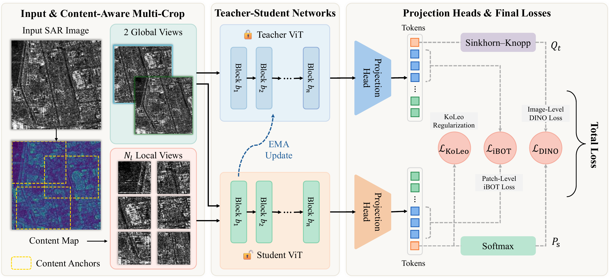
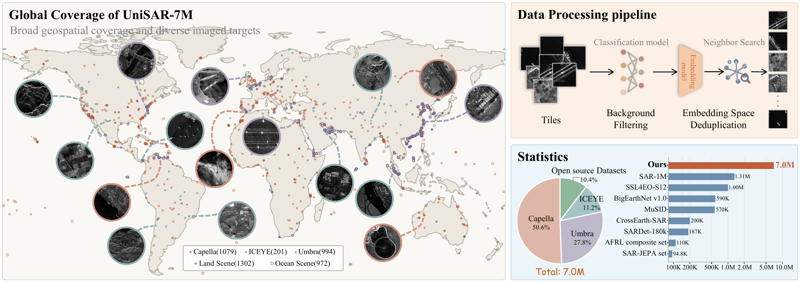

<div align="center">

# DINOSAR: Large-Scale SAR Self-Supervised Pretraining with Content-Aware View Construction

**Submitted to the International Journal of Digital Earth (IJDE)**

**[Project homepage](https://ehehe.cn/DINOSAR/)** · **[Getting started](#getting-started)** · **[Results](docs/results.md)** · **[Citation](#citation)**

[](https://huggingface.co/YTang/DINOSAR)
[](https://huggingface.co/datasets/YTang/UniSAR-7M)


</div>

## Overview

**DINOSAR** learns transferable representations from single-channel SAR imagery.
Its **Content-Aware Multi-Crop (CAMC)** strategy uses ratio-gradient content maps
and scene-adaptive anchors to sample informative, diverse global and local views.
A teacher–student framework combines DINO, iBOT, and KoLeo objectives to pretrain
ViT encoders on UniSAR-7M.

[](assets/framework_overview.png)

*CAMC constructs global and local views; the EMA teacher processes global views,
while the student processes all views.*

## Pretrained models

Both models are pretrained for **60 epochs on UniSAR-7M**. Downloads contain
teacher backbone-only weights for feature extraction and downstream initialization.

| Model | Weights | Training config | Training log |
|---|---|---|---|
| ViT-S/16 | [86 MB](https://huggingface.co/YTang/DINOSAR/resolve/main/dinosar_s16_unisar7m_60e.pth) | [YAML](https://huggingface.co/YTang/DINOSAR/blob/main/training/dinosar_s16_unisar7m_60e/config.yaml) | [JSONL](https://huggingface.co/YTang/DINOSAR/resolve/main/training/dinosar_s16_unisar7m_60e/metrics.jsonl) |
| ViT-B/16 | [341 MB](https://huggingface.co/YTang/DINOSAR/resolve/main/dinosar_b16_unisar7m_60e.pth) | [YAML](https://huggingface.co/YTang/DINOSAR/blob/main/training/dinosar_b16_unisar7m_60e/config.yaml) | [JSONL](https://huggingface.co/YTang/DINOSAR/resolve/main/training/dinosar_b16_unisar7m_60e/metrics.jsonl) |

See the [Model Card](https://huggingface.co/YTang/DINOSAR#loading) for loading
examples, input preprocessing, and model configurations.

## UniSAR-7M

**UniSAR-7M contains 7,047,666 SAR image samples**, combining five public datasets
with imagery from 2,274 Capella, ICEYE, and Umbra scenes. Commercial scenes are
tiled into non-overlapping 256 × 256 patches, then filtered and deduplicated;
public datasets follow source-specific preparation.

[](assets/unisar7m_overview.png)

**[Hugging Face dataset and documentation](https://huggingface.co/datasets/YTang/UniSAR-7M)** · **[Google Drive](https://drive.google.com/drive/folders/16hax44FA9aAQfiypqBPfsSandtYl_auc)**

The distribution consists of 18 archive parts. See the
[Dataset Card](https://huggingface.co/datasets/YTang/UniSAR-7M#download-and-reconstruction)
for availability, source statistics, and reconstruction instructions.

## Getting started

Use a **separate environment for each task**; their dependencies are not interchangeable.

| Task | Environment | Setup and usage |
|---|---|---|
| Pretraining and classification | Python 3.10–3.12; PyTorch 2.10.0 / torchvision 0.25.0, CUDA 12.8 wheels; `uv` | [DINOSAR](DINOSAR/README.md) · [Evaluation](DINOSAR/docs/eval_guide.md) |
| Object detection | PyTorch ≥2.3 / torchvision ≥0.18; Detectron2 (`fd27788`) and DINOv3 | [DINOSAR_Detection](DINOSAR_Detection/README.md) |
| Semantic segmentation | Dedicated conda environment (Python 3.10 by default); PyTorch 2.11.0, CUDA 12.8, MMCV 2.1.0, MMSegmentation 1.2.2 | [DINOSAR_Segmentation](DINOSAR_Segmentation/README.md) · [Environment](DINOSAR_Segmentation/docs/environment.md) |
| Image–text retrieval | Python ≥3.11; PyTorch ≥2.3 and OpenCLIP ≥3.0 | [DINOSAR_Retrieval](DINOSAR_Retrieval/README.md) |

For pretraining and classification, install from the repository root:

```bash
cd DINOSAR
uv sync
```

**Pretrain for 60 epochs** on the prepared UniSAR-7M image directory:

```bash
uv run bash scripts/pretrain.sh dinosar/configs/pretrain/unisar7m/vitb16_reg.yaml \
  data.data_path=/path/to/UniSAR-7M
```

Use `vits16_reg.yaml` for ViT-S. The launcher defaults to four GPUs;
set `NUM_GPUS` to match your machine. See the [training guide](DINOSAR/docs/runtime_guide.md)
for batch-size settings, resuming, and checkpoint export.

**Evaluate the released ViT-B with k-NN** after [preparing classification data](DINOSAR/docs/datasets.md):

```bash
uvx hf download YTang/DINOSAR dinosar_b16_unisar7m_60e.pth --local-dir experiments/weights
uv run -m dinosar.evaluate --config dinosar/configs/eval/knn.yaml \
  model.arch=vit_base model.drop_path_rate=0.2 \
  model.checkpoint_path=experiments/weights/dinosar_b16_unisar7m_60e.pth \
  data.root=/path/to/MSTAR data.train_split=train data.val_split=test \
  eval.output_dir=experiments/eval/vitb60e/MSTAR/knn
```

See the [evaluation guide](DINOSAR/docs/eval_guide.md) for ViT-S, linear probing,
few-shot learning, and full fine-tuning. The [visualization notebook](DINOSAR/notebooks/patch_similarity_pca.ipynb)
includes example images and automatically downloads the selected pretrained weights.

## Results

See the [full result tables](docs/results.md) for frozen-backbone classification,
few-shot recognition, full fine-tuning, object detection, semantic segmentation,
image–text retrieval, and CAMC component ablations.

## License

The original DINOSAR code in [`DINOSAR/`](DINOSAR/) is released under the
[MIT License](DINOSAR/LICENSE). This license does not override the licenses of
third-party code, models, or datasets. The detection, segmentation, and retrieval
integrations must be used in accordance with the licenses and terms of their
respective upstream projects and dependencies; no common license is assigned to
those third-party components here. Refer to the upstream projects and the
Hugging Face model and dataset cards for their applicable terms.

## Acknowledgment

We thank the authors of [DINOv2](https://github.com/facebookresearch/dinov2)
and [DINOv3](https://github.com/facebookresearch/dinov3) for their open-source
implementations, and the teams behind [SARMAE](https://github.com/MiliLab/SARMAE),
[SARATR-X](https://github.com/waterdisappear/SARATR-X),
[SUMMIT](https://github.com/Yunsans/SUMMIT-SAR), and
[SAR-JEPA](https://github.com/waterdisappear/SAR-JEPA) for advancing open SAR
representation learning. We also thank the maintainers of
[Detectron2](https://github.com/facebookresearch/detectron2),
[MMSegmentation](https://github.com/open-mmlab/mmsegmentation), and
[OpenCLIP](https://github.com/mlfoundations/open_clip), and the contributors of
the source datasets, for making this research possible.

## Citation

```bibtex
@unpublished{tang2026dinosar,
  title = {{DINOSAR}: Large-Scale {SAR} Self-Supervised Pretraining with Content-Aware View Construction},
  author = {Tang, Yan and Jin, Yifeng and Miao, Zekai and Ji, Min and Duan, Yu and Zhang, Shaoming and Wang, Jianmei},
  year = {2026},
  note = {Submitted to the International Journal of Digital Earth}
}
```
